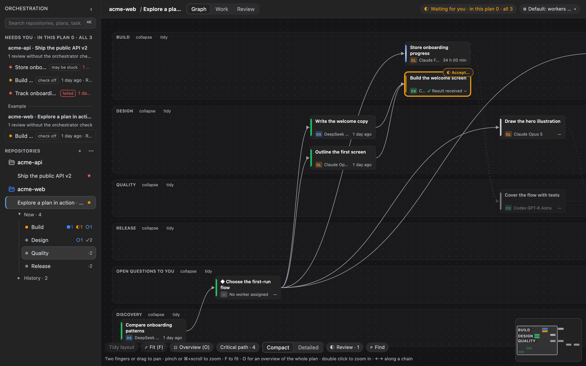
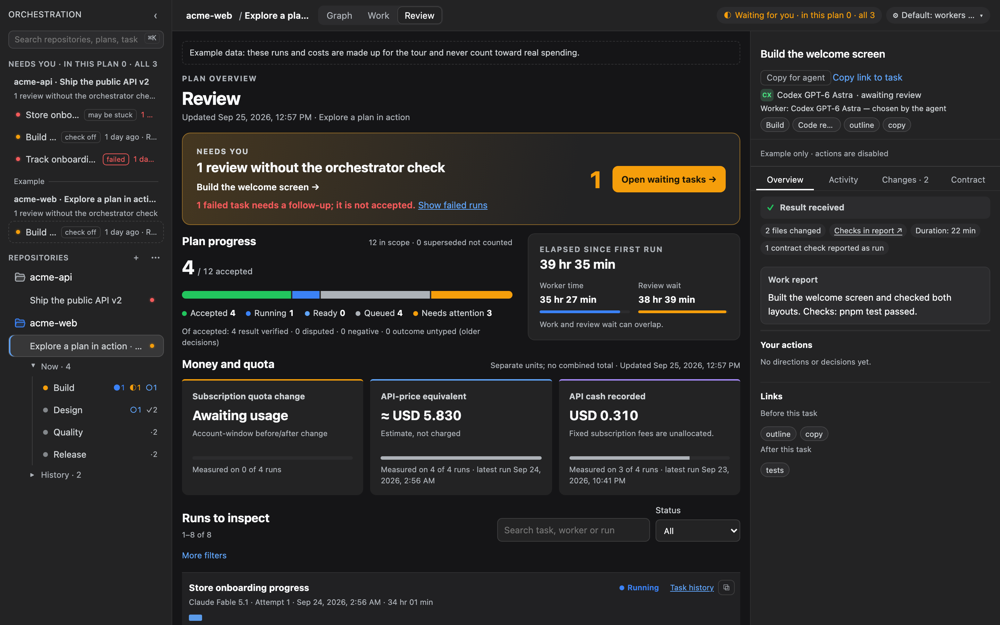
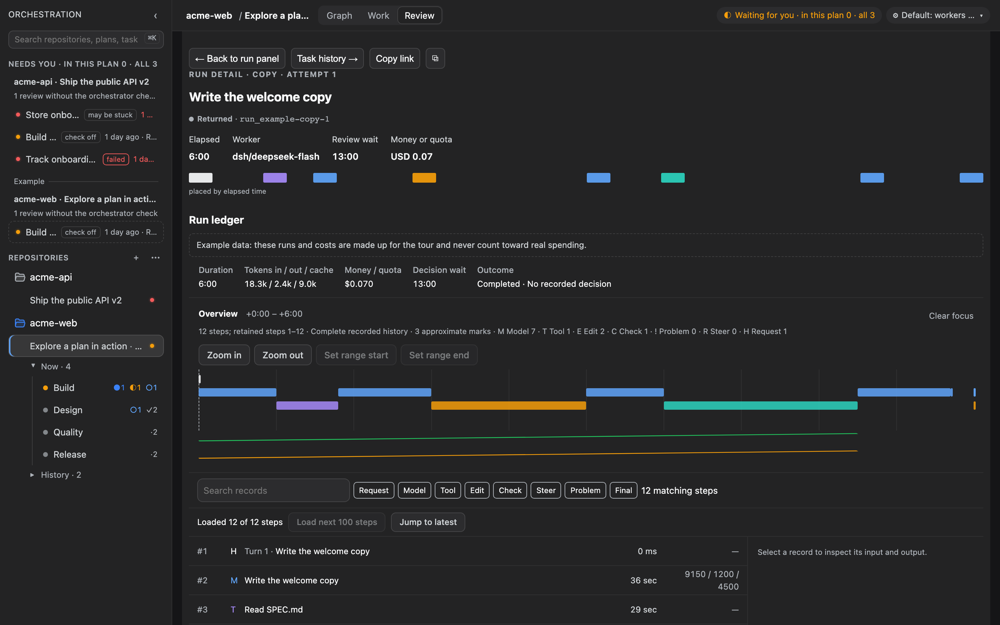

# Crewboard

[English](README.md) | **Русский**

[](https://github.com/Kjaly/crewboard/actions/workflows/ci.yml)
[](LICENSE)

**Состояние:** 0.4.0 (версия из манифестов пакетов; релиз в npm ещё не опубликован) · Node.js 24+ · используется на macOS с кандидатами в релиз dsh 0.1.5 · Linux и Windows не проверялись

**Видеть работу кодовых агентов во всех проектах.**\
Планы, запуски, затраты и решения — в одном месте.

Crewboard — это плагин для [DeepSeek Harness](https://github.com/deepseek-ai/deepseek-harness) (`dsh`) и консольная утилита `crewboard` (`orch` — та же программа). Обе работают с одним планом на репозиторий, который лежит рядом с кодом, но не попадает в историю Git.



*Встроенный пример: граф плана одного репозитория; в боковой панели другой репозиторий ждёт решения.*

## Как это работает

1. **Цель становится планом.** В dsh чат, который ведёт план (оркестратор), составляет задачи и контракты по вашей цели. В терминале то же вручную делают `crewboard init` и `crewboard task add`.
2. **Задачи берут воркеры, выбранные пресетом.** Codex, Claude Code, DeepSeek через dsh и Devin работают в одном плане. Какой воркер берёт задачи какого класса, решает пресет, на том эффорте (насколько усердно думает его модель), с которым воркер зарегистрирован; человек может выбрать другого, агент — нет. Каждый запуск получает свою рабочую копию (Git worktree).
3. **Сначала проверяет оркестратор.** Когда воркер закончил, оркестратор берёт результат на проверку (`crewboard verify`) — он умеет и сам прогнать проверки контракта, рядом с заявлением воркера. Он передаёт задачу вам со сводкой или возвращает воркеру с замечаниями. Это включено, пока у плана есть чат; иначе законченная работа сразу приходит к вам. Работу, которую рискованно отдавать воркеру (интеграция на стенде, база владельца), оркестратор делает сам как задачу `root` (`crewboard start`, затем `crewboard verify --done --report`), а решение приходит к вам только после того, как оркестратор подготовил варианты.
4. **Оркестратор закрывает обычную работу.** После положительного вердикта, своей проверки и зелёных обязательных проверок он может принять и слить задачу. Решения, спорные результаты и контракты с `<human_review>` остаются вам. Вы по-прежнему можете принять или вернуть работу сами.
5. **Принятая работа сливается в ветку плана.** Приёмка оставляет ветку задачи отдельно. Оркестратор может выполнить слияние через `orchestra_close` после проверки базы и конфликтов; экран и `crewboard merge` тоже доступны. Пока слияние не выполнено, Crewboard показывает **«Принята, не слита»**, а зависимые задачи ждут.

## Кому подойдёт

Я веду несколько репозиториев через кодовых агентов и не видел, чем занят каждый агент, где пора вмешаться и как соединить разных провайдеров в одном плане. Crewboard я написал для этого и выкладываю, потому что мне он помог.

**Вам подойдёт, если** у вас в работе несколько репозиториев, вы пользуетесь не одним кодовым агентом и хотите видеть, что они делают, а итоговое решение принимать сами.

**Не подойдёт, если** нужна одна небольшая правка одним агентом или вы хотите, чтобы агенты сами принимали свою работу. Контракты и приёмка — сознательная дополнительная работа.

## Что вы видите и что решаете

- **Все репозитории в одной панели.** Подключённые репозитории, их планы и очередь **«Ждут вас»** — всё, что ждёт человека.
- **План — это граф.** У задачи есть зависимости, класс и контракт с ожидаемым результатом и проверками. Видно состояние каждой задачи и критический путь.
- **Журнал запуска у каждого запуска.** Что запуск сделал и что заявил: события, изменённые файлы, отчёт воркера и какие проверки контракта он, по его словам, выполнил.
- **Затраты не смешиваются.** Списанные деньги, оценка по тарифам API и «нет данных» выглядят по-разному. Подробнее — [что означает каждое число](docs/ru/costs.md).
- **Важные решения за вами.** Оркестратор может принять и слить обычную проверенную работу; решения, спорные результаты и явная проверка человеком остаются вам.

## Установка

**Текущая установка — из исходников.** Релиз в npm ещё не опубликован, поэтому сегодня путь установки — команды ниже; `npm install -g crewboard` и `dsh plugin --profile web add dsh-crewboard` станут доступны только после публикации релиза сопровождающим (см. [releasing](docs/releasing.md)).

### Что нужно заранее

- **Для установки:** Node.js 24 или новее, pnpm 11.5.2 и Git.
- **Для экрана:** dsh (DeepSeek Harness): `npm install -g @deepseek-ai/dsh`. CLI работает и без него.
- **Для чата-оркестратора** (быстрый старт A, **«Из чата»**): ключ DeepSeek API. Чат работает на DeepSeek внутри dsh; добавьте ключ в dsh в **Settings → Models** или экспортируйте `DEEPSEEK_API_KEY`. Воркеры dsh используют тот же ключ.
- **Для каждого воркера:** его CLI, установленный и готовый: `codex login`, `devin auth login`, или воркер dsh с ключом DeepSeek выше. Автоматическому Claude Code нужен явный `ANTHROPIC_API_KEY` и официальный endpoint Anthropic вместо подписочного входа (см. [политику API-only](docs/notes/2026-09-28-anthropic-automation-policy.md)). `crewboard preflight` проверяет их все, а экран пишет «готов» только после того, как проверка прошла.
- **Чтобы принимать работу на экране:** dsh, запущенный на macOS. **«Принять»** спрашивает подтверждение в окне macOS; на других системах принимайте в терминале: `crewboard accept <id>`.

Соберите CLI из исходников; появятся оба имени, `crewboard` и `orch`:

```sh
git clone https://github.com/Kjaly/crewboard.git
cd crewboard
pnpm install --frozen-lockfile
pnpm build
node packages/cli/dist/main.js --help
```

Примеры ниже пишут `crewboard` (и `orch`). Из чекаута без глобальной установки запускайте их как `node packages/cli/dist/main.js …` или задайте shell-функции с абсолютным путём (для текущего сеанса терминала):

```sh
CREWBOARD_CLI="$PWD/packages/cli/dist/main.js"
crewboard() { node "$CREWBOARD_CLI" "$@"; }
orch() { crewboard "$@"; }
```

Нужен только терминал? На этом всё: CLI работает без dsh и не тянет за собой приватных зависимостей. dsh добавляет экран, уведомления, чат оркестратора и воркеров dsh.

Чтобы добавить экран, установите плагин из того же чекаута в профиль dsh `web` по пути:

```sh
dsh plugin --profile web add "$PWD/packages/plugin"
```

После публикации эти два шага станут `npm install -g crewboard` и `dsh plugin --profile web add dsh-crewboard`.

Затем добавьте репозитории, которые нужно показывать: нажмите **+** рядом с **Репозитории** на экране и вставьте путь к папке или выполните `crewboard init` (или `crewboard repo add`) внутри репозитория. Воркспейсы dsh появляются сами; настройка плагина `repos` и `CREWBOARD_REPOS` по-прежнему работают. Подробности и то, что стоит проверить в своём dsh, — в разделе [подключение плагина](docs/ru/plugin-setup.md#подключите-репозитории).

[CONTRIBUTING.md](CONTRIBUTING.md) описывает полную сборку из исходников, проверки и запуск стенда плагина.

Проверено на macOS (Node.js 24.16, pnpm 11.5.2) из исходников и в одноразовом профиле dsh. Не проверено: экран во всех версиях dsh, чистая машина, Linux, Windows.

## Быстрый старт A: из чата dsh

1. Запустите `dsh web` и откройте **Orchestration**: иконка графа (три связанные точки) в левой колонке dsh, подсказка при наведении — Orchestration.
2. Если плана ещё нет, выберите **«Из чата»**. Откроется чат dsh с просьбой к агенту составить черновик плана. Опишите цель, прочитайте черновик и утвердите его кнопкой **«Утвердить как план»**; это может только человек. Для существующего плана есть **«Открыть чат плана»** и **«Сделать этот чат оркестратором»**.
3. Чат пишет контракт для каждой задачи и запускает воркеров; их выбирает пресет. Следите за запусками на видах **«Граф»** и **«Работа»**.
4. Когда запуск закончен, задача показывает «Проверяет оркестратор», пока чат с ней не закончит.
5. Затем задача появляется в **«Ждут вас»**; в её панели сводка оркестратора стоит над кнопкой **«Принять»**. Выберите **«Принять»** или **«Вернуть»** и подтвердите.
6. Принятая задача остаётся в **«Ждут вас»** как **«Принята, не слита»**, пока вы не сольёте её ветку; в панели задачи есть команды. Зависящие задачи стартуют после слияния.

Проверка и её настройка описаны в разделе [приёмка](docs/ru/review.md#проверка-оркестратором).

## Быстрый старт B: только CLI

В Git-репозитории создайте план и задачу, и получите шаблон контракта для заполнения:

```sh
crewboard init --goal "Разбить API на модули"
crewboard task add api --title "Вынести API" --class code --template
```

`--template` пишет шаблон в `.orchestration/contracts/main/api.md`. Откройте его и заполните, что должно быть верно, когда работа закончена (раздел **Результат**), и команды, которые запускает проверяющий, по одной в строке между `<checks>` и `</checks>`:

```markdown
## Результат

Перенести HTTP-обработчики из src/server.ts в src/api/, не меняя поведения.

## Проверки

…

<checks>
- pnpm test
</checks>
```

`run` отказывается запускать контракт, пока он читается как незаполненный шаблон (`--force` — в обход). Дальше:

```sh
crewboard status          # что можно запускать, что ждёт, критический путь
crewboard workers         # зарегистрированные воркеры и их порядок по классам задач
crewboard run api         # воркер пресета для класса code, в своей рабочей копии
crewboard events api      # что сейчас делает воркер
```

После запуска агент может проверить результат; решает человек в интерактивном терминале:

```sh
crewboard verify api --done --note "тесты зелёные"   # необязательно: проверка оркестратором
crewboard accept api
crewboard reject api --reason "Совместимость маршрутов не проверена"   # вернуть
```

`accept` печатает следующий шаг: работа лежит в ветке `orch/api-…`, пока вы её не сольёте, и задачи, зависящие от `api`, этого ждут:

```sh
crewboard merge api                            # или вручную: git merge --no-ff orch/api-extract-the-api, в основной копии на базовой ветке
crewboard status                               # api больше не «принята, не слита»
```

Интерфейс CLI на русском включается через `LANG`/`LC_ALL` или флагом `--lang ru`. Подробнее — в разделе [начало работы](docs/ru/getting-started.md), все команды — в [справочнике CLI](docs/ru/cli.md).

## Экраны



*Итоги: что ждёт вас, как продвинулся план, сколько это стоило и задача, по которой нужно решение.*



*Журнал запуска: что сделал один запуск, шаг за шагом, и сколько это стоило.*

Боковая панель, панель задачи, вид «Работа» и настройки — в разделе [начало работы](docs/ru/getting-started.md#экран).

## Границы

- **Доказательства — это то, что оставил запуск, а не гарантия.** Вердикт отмечает расхождения между заявлением воркера и запуском, но не решает за вас. См. [приёмку](docs/ru/review.md).
- **Затраты точны настолько, насколько точен источник.** Одни запуски сообщают деньги, другие — токены или квоту, третьи — ничего.
- **Планы остаются в репозитории.** Они лежат в `.orchestration/`, исключённом через `.git/info/exclude`; профили воркеров и пресеты — в `~/.config/crewboard/`. Непринятые и изменённые рабочие копии автоматически не удаляются.
- **Пока только macOS.** Окна подтверждения — это окна macOS, а связку с dsh я проверяю только на тех версиях dsh, что у меня.
- **Для автоматизации Claude действует консервативная API-only политика.** Защита реализована и активируется обновлением Crewboard — см. [датированную политику и статус реализации](docs/notes/2026-09-28-anthropic-automation-policy.md). Подписочный вход исключён из автоматизации Crewboard; это строже некоторых официально разрешённых сценариев. Интерактивный Claude вне Crewboard не затрагивается; для защищённого запуска Claude счёт API не записывается — только клиентская оценка, отделённая от квоты подписки.

Пакеты и поток данных описаны в [заметках об архитектуре](docs/architecture.md) (на английском).

## Документация и помощь

- [Оглавление документации](docs/README.md)
- [Начало работы](docs/ru/getting-started.md) · [Подключение плагина](docs/ru/plugin-setup.md) · [Справочник CLI](docs/ru/cli.md) · [Воркеры](docs/ru/workers.md) · [Приёмка](docs/ru/review.md) · [Затраты](docs/ru/costs.md) · [Если что-то не работает](docs/ru/troubleshooting.md)
- [Участие в разработке](CONTRIBUTING.md) · [Безопасность](SECURITY.md) · [Кодекс поведения](CODE_OF_CONDUCT.md) · [Изменения](CHANGELOG.md) · [Лицензия MIT](LICENSE) — на английском

Вопросы и ошибки: [GitHub issues](https://github.com/Kjaly/crewboard/issues).
