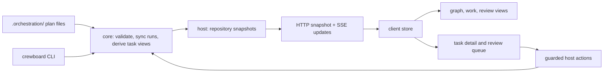

# Architecture

Crewboard has one plan engine and two ways to operate it: the `crewboard` CLI (also installed as `orch`) and a DeepSeek Harness (`dsh`) plugin, `dsh-crewboard`. The plan is durable repository data; the screen is a live projection of it.

## Packages and boundaries

| Package | Responsibility | Boundary |
| --- | --- | --- |
| `packages/core` | Plan schema and store, dependency graph, run backends, worker routing, supervision, evidence, verdict, and worktree lifecycle. | Node-side code with no React or dsh runtime package dependency. It does contain explicit adapters for the `dsh` ACP process, dsh workspace storage, and dsh-bill records; those are not browser service access. |
| `packages/cli` | `crewboard` command parsing and presentation. | Calls core; does not own a second plan model. |
| `packages/plugin/src/host` | dsh host integration: repository discovery, snapshots, HTTP and SSE routes, tools, chat wakeups, native confirmation, and host localization. | Calls core and exposes a narrow API to the browser. Reads optional dsh host services only after injection. |
| `packages/plugin/src/client` | React screen, settings, notifications, and navigation. | Consumes host API and SSE; uses dsh slots and optional client services through structural faces. No Node modules or dsh runtime imports in the browser bundle. |

The host and client are built as separate entry points. dsh loads the host plugin and browser bundle; `crewboard` works on a repository without the screen.

## From plan file to screen

The active plan is selected by `.orchestration/current`; the original `main` plan remains `.orchestration/plan.json`, and additional plans live in `.orchestration/plans/`. Core parses each plan, checks dependencies and run state, derives ready, blocked, running, and review states, and builds a repository snapshot. The host combines dsh workspace repositories with configured paths, refreshes snapshots through a file watcher and polling, and serves them over HTTP and SSE. The React store keeps selection and view preferences per plan and renders the snapshot. Task details and diffs are fetched on demand. Background plans are synced too, so their finished runs can raise attention while another plan is open.

Plan writes take a lock, compare revisions, and replace files atomically. A corrupt plan is copied aside and treated as read-only until repaired. This prevents a broken file from silently becoming a new empty plan.

## Trust and human decisions

Workers can write in their task worktrees and report results. Their report, event feed, and verdict are evidence for review; none of them grants acceptance. Core derives verdict facts from the result claim, run outcome, changed files, and known contract checks. A person makes the final accept, return, or supersede decision. The dsh host checks action requests, resolves the repository and task, and asks for native confirmation before a review decision. The CLI uses an interactive human path. dsh agent tools expose planning and supervision, but no acceptance tool.

The browser is outside the trusted write boundary. It calls host routes with the plugin client header and validated request bodies; the header is a request guard, not authentication against an arbitrary local client. The host enforces the decision and mutation rules. Contracts and task paths are read relative to the repository; core validates task and worktree operations before touching files. Automatic worktree removal is conservative and reports why a copy remains.

## dsh service access and other decisions

- Cordis services are available through injection, not by assuming a root context property is readable. The client accessor in `src/client/dsh.ts` and the host accessor in `src/host/boundary.ts` validate the small structural face needed by each side, adopt replacements, and release references on disposal. Optional service absence disables only its related feature.
- The browser follows dsh's locale snapshot and subscription; the host reads the stored locale preference through the injected settings service. English is the fallback. User-authored names, contracts, and reports remain unchanged.
- Worker selection resolves a plan preset, then a repository preset, then the built-in order; machine-level disablement still wins. The registry is data, so the CLI and screen see the same workers.
- Graph layout is loaded separately from the main client bundle. Folding and lenses help read large plans without removing the underlying tasks or dependencies.
- Run evidence stays alongside completed runs. Review and batch acceptance preserve each task's verdict, making a later audit possible after worktree cleanup.

See the [README](../README.md) and the [user guides](README.md) for installation and operation, and [CONTRIBUTING](../CONTRIBUTING.md) for development checks.
