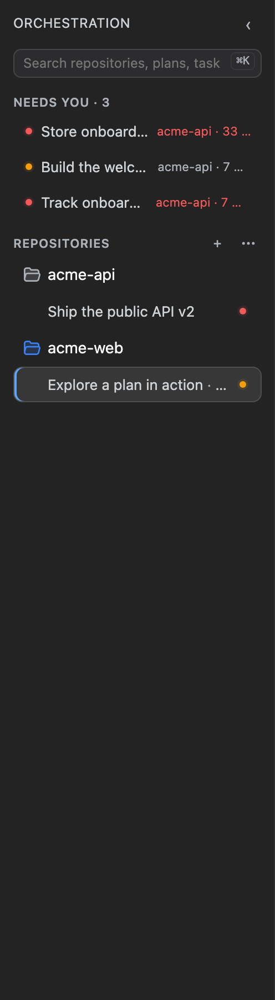
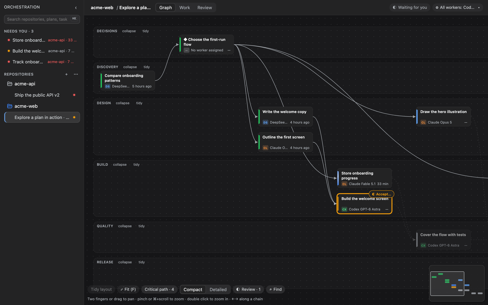
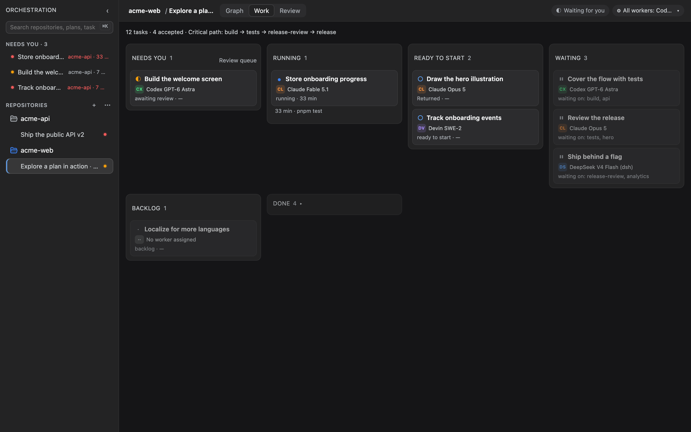
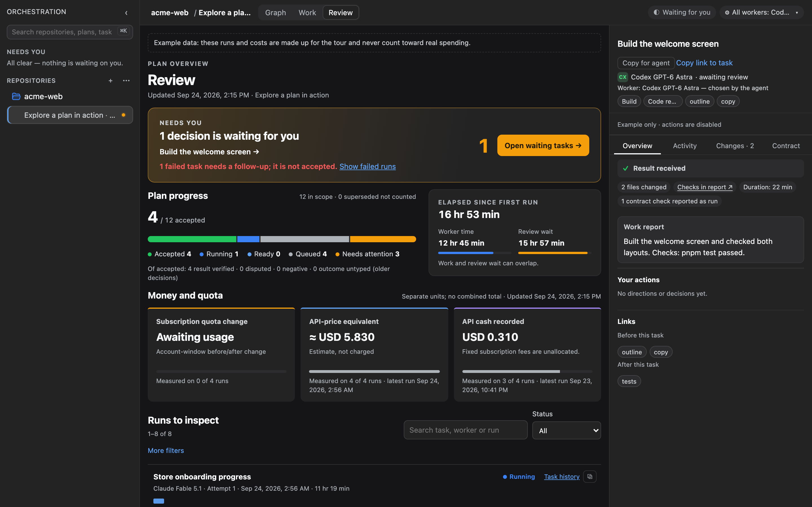
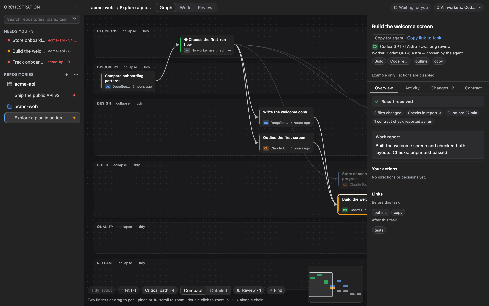
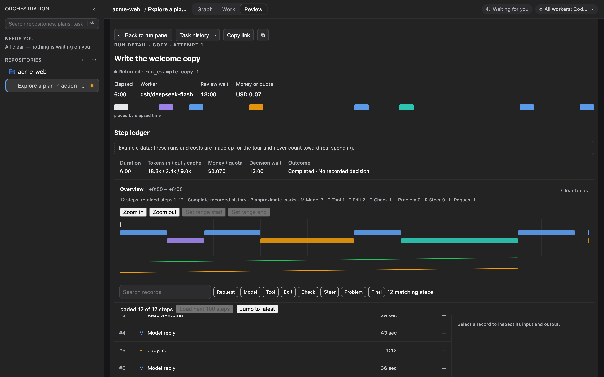

# Getting started

[Documentation](../README.md) · **English** | [Русский](../ru/getting-started.md)

This guide takes one repository from an empty plan to a decision on the first result. It uses the CLI; the same plan appears on the dsh screen once the [plugin is set up](plugin-setup.md).

## Before you start

- Node.js 24 or newer, Git, and `npm install -g crewboard`.
- At least one worker CLI, installed and signed in: Claude Code (`claude`), Codex (`codex`), Devin (`devin`), or dsh (`dsh`). See [workers](workers.md).
- A Git repository with at least one commit. Crewboard creates task worktrees from it.

`crewboard` and `orch` are the same program; the help and messages use whichever name you typed.

## 1. Create a plan

Run commands from inside the repository:

```sh
crewboard init --goal "Split the API into modules"
```

This creates `.orchestration/plan.json` (the `main` plan) and adds `.orchestration/` to `.git/info/exclude`, so plan data is not committed by accident. A repository can hold several plans; see `crewboard plan` in the [CLI reference](cli.md#plans).

## 2. Write a contract

A task can run only with a contract: a file in the repository that states the result you want and how to check it. Keep it short and concrete. Put the commands you expect the worker to run in a `<checks>` block, one per line — the review screen uses this block to tell which checks the worker reported running.

```markdown
# Extract the API module

Move the HTTP handlers from src/server.ts into src/api/ without changing behaviour.
Out of scope: renaming routes.

<checks>
- pnpm test
- pnpm typecheck
</checks>
```

Ask the worker to start its final answer with a result line, for example `Result: received`, `Result: negative`, or `Result: blocked`. The verdict reads that line; see [review](review.md).

## 3. Add tasks

```sh
crewboard task add api --title "Extract the API" --class code --contract docs/tasks/api.md
crewboard task add docs --title "Document the API" --deps api --class research --contract docs/tasks/docs.md
crewboard status
```

`status` shows each task, what it waits for, the tasks ready to start, and the critical path:

```text
Split the API into modules · rev 3

Preset: All workers (source: builtin)
○ api   Extract the API
⏸ docs  Document the API · waiting for api

Ready to start: api
Critical path: api → docs
```

The class (`code`, `design`, `review`, `research`) decides which workers are tried automatically. `--kind decision` creates a task that only a person closes.

## 4. Run a worker

```sh
crewboard workers        # the registry and the order per class
crewboard preflight -a codex
crewboard run api        # or: crewboard run api -a claude/opus
```

Without `-a`, Crewboard uses the task's own worker, or the first worker of the task's class that is enabled and passes its preflight check. The run gets its own worktree next to the repository, on an `orch/api-…` branch. [Workers](workers.md) explains the order in detail.

## 5. Watch

```sh
crewboard events api       # the task's event feed
crewboard trace api        # turns, model time, tool calls
crewboard attention        # what waits on you: reviews, decisions, failed runs
crewboard steer api --message "Keep the old route names"
```

An orchestrating agent can wait in the background and wake up when something changes:

```sh
crewboard wait --for any --timeout 30m
```

It exits with `0` when a task was decided or a run finished, `2` on timeout, and `1` on error.

## 6. Decide

When the run finishes, the task is waiting for review. Read the report, the evidence, and the changes — on the screen, or with `crewboard events api` and in the worktree. Then, in an interactive terminal:

```sh
crewboard accept api
crewboard reject api --reason "Route compatibility is not verified"
crewboard supersede api --by api-v2
```

Each command asks for confirmation and refuses to run without an interactive terminal, so an agent cannot accept its own work. After acceptance, the worktree is removed if your cleanup policy says so. [Review](review.md) describes the verdict and evidence.

## The screen

With the [plugin](plugin-setup.md) installed, open **Orchestration** in the dsh sidebar; the entry also shows how many items wait for you. The screen shows the same plans as the CLI. Its settings are under **Crewboard** in dsh settings.



*The sidebar lists repositories and plans. **Needs you** collects work waiting for a person across all of them.*



*The **Graph** view (key `1`) shows dependencies and the critical path. Focus lenses highlight tasks that need attention, are running, are ready, or are in review, without hiding the rest.*



*The **Work** view (key `2`) groups tasks by state and shows who works on them and what waits for you.*



*The **Review** view (key `3`) collects finished work, verdicts, and plan-level totals.*



*The task panel has the overview, activity, changes, contract, your actions, and links, with **Accept** and **Send back** for a task in review.*



*The run ledger shows the steps of a run, its model and tools, and what is known about its cost.*


*Settings: workers, availability checks, the order per task class, presets, and worktree cleanup.*

## Next

- [CLI reference](cli.md) — every command and flag.
- [Workers](workers.md) — registry, presets, and how a worker is chosen.
- [Troubleshooting](troubleshooting.md) — when a run does not start.
