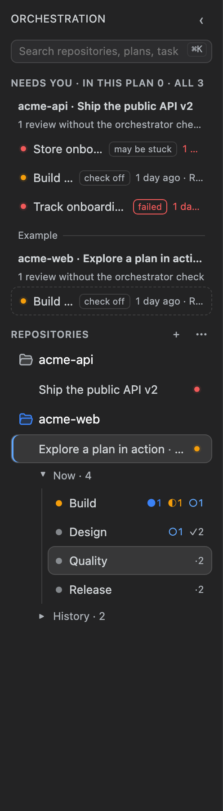
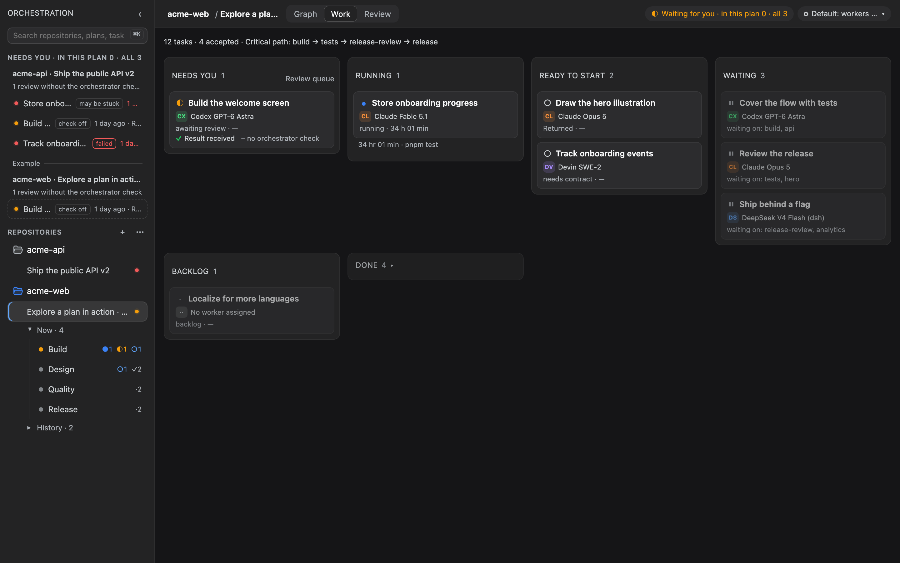
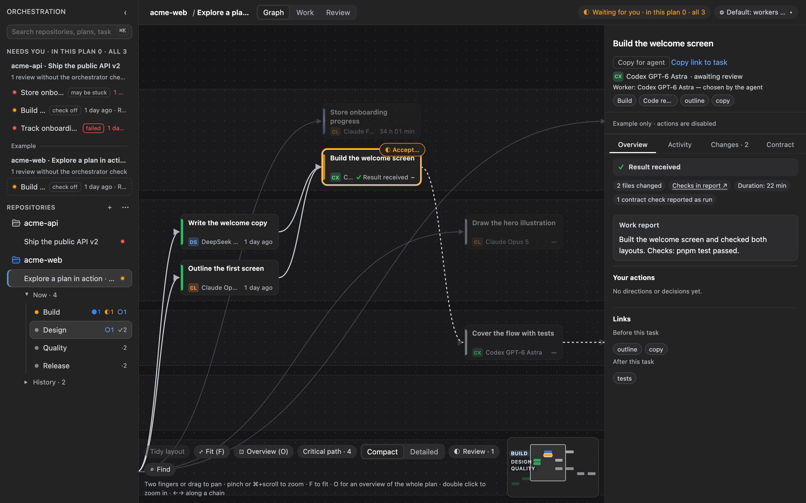
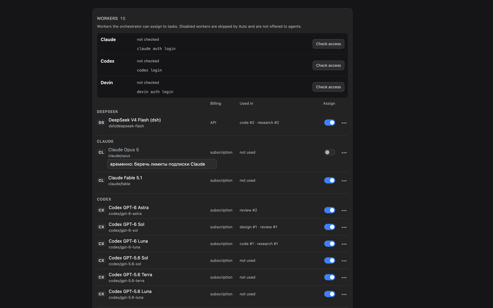

# Начало работы

[Документация](../README.md) · [English](../en/getting-started.md) | **Русский**

Здесь один репозиторий проходит путь от пустого плана до решения по первому результату. Всё делается через CLI; тот же план появится на экране dsh, когда [плагин будет подключён](plugin-setup.md).

## Что нужно заранее

- Node.js 24 или новее, pnpm 11.5.2 и Git, а CLI собран из исходников (релиз в npm ещё не опубликован): `pnpm install --frozen-lockfile && pnpm build`. См. [README: установка](../../README.ru.md#установка).
- Хотя бы один CLI воркера, установленный и готовый: Codex (`codex`), Devin (`devin`) или dsh (`dsh`); автоматическому Claude Code (`claude`) нужен явный `ANTHROPIC_API_KEY` — его подписочный вход не используется. См. [воркеры](workers.md).
- Git-репозиторий хотя бы с одним коммитом: от него создаются рабочие копии задач.

`crewboard` и `orch` — одна и та же программа; справка и сообщения используют то имя, которым вы её вызвали. Примеры ниже пишут `crewboard`; из чекаута запускайте их как `node packages/cli/dist/main.js …` или задайте алиас из [шагов установки](../../README.ru.md#установка). Русский интерфейс CLI включается сам, если `LANG` или `LC_ALL` начинается с `ru`, либо флагом `--lang ru`.

## 1. Создайте план

Команды запускаются внутри репозитория:

```sh
crewboard init --goal "Разбить API на модули"
```

Появится `.orchestration/plan.json` (план `main`), а `.orchestration/` добавится в `.git/info/exclude`, чтобы данные плана случайно не попали в коммит. В одном репозитории может быть несколько планов — см. `crewboard plan` в [справочнике CLI](cli.md#планы).

## 2. Напишите контракт

Задачу можно запустить только с контрактом — файлом в репозитории, где сказано, какой нужен результат и как его проверить. Пишите коротко и конкретно.

У каждого контракта, который пишет Crewboard, одни и те же разделы в одном порядке: заголовок, **Контекст**, **Результат**, **Проверки**, **Вне задачи**, **Источники** и **Отчёт**. Этот шаблон один для всех путей: одобрение черновика плана, задача-продолжение и задача-замена, `crewboard task add --template` и задачи, которые создаёт оркестратор. Контекст, «Вне задачи» и источники появляются, только когда есть что написать; проверки и отчёт есть всегда:

- **Проверки** — блок `<checks>`, по одной команде в строке. По нему экран приёмки определяет, какие проверки воркер отметил как выполненные. Блок открывается строкой, в которой стоит только `<checks>`, и закрывается строкой, в которой стоит только `</checks>`; тег внутри предложения, в `коде` или в блоке кода — это текст, а не блок. Если блоков несколько, считается последний. То же правило действует для `<paths>`.
- **Отчёт** просит воркера начать финальный ответ строкой `Результат: получен`, `Результат: отрицательный` или `Результат: заблокирован` (или по-английски `Result: received | negative | blocked`). Эту строку читает вердикт — см. [приёмку](review.md).

Чтобы начать с шаблона, попросите Crewboard записать заготовку и заполните её:

```sh
crewboard task add api --title "Вынести модуль API" --class code --template
#   контракт: .orchestration/contracts/main/api.md — допиши результат и проверки, затем crewboard run api
```

Заполненный контракт выглядит так:

```markdown
# Вынести модуль API

## Результат

Перенести HTTP-обработчики из src/server.ts в src/api/, не меняя поведения.

## Проверки

По одной команде в строке между тегами. Запусти каждую перед отчётом и назови каждую в отчёте с исходом.

<checks>
- pnpm test
- pnpm typecheck
</checks>

## Вне задачи

- Переименование маршрутов

## Отчёт

Начни финальный ответ одной строкой: `Результат: получен`, `Результат: отрицательный` или `Результат: заблокирован` — выбери по фактам. …
```

Контракт можно написать и вручную и подключить через `--contract <файл>`. `crewboard run` предупреждает — но не отказывает, — если в контракте нет проверок или он не просит строку результата.

## 3. Добавьте задачи

```sh
crewboard task add api --title "Вынести API" --class code --contract docs/tasks/api.md
crewboard task add docs --title "Описать API" --deps api --class research --contract docs/tasks/docs.md
crewboard status
```

`status` показывает каждую задачу, чего она ждёт, какие задачи готовы к запуску и критический путь:

```text
Разбить API на модули · rev 3

Пресет: Все воркеры (источник: встроенный)
○ api   Вынести API
⏸ docs  Описать API · ждёт api

Можно запускать: api
Критический путь: api → docs
```

Класс (`code`, `design`, `review`, `research`) определяет, каких воркеров пробовать автоматически. `--kind decision` создаёт задачу, которую закрывает только человек.

## 4. Запустите воркера

```sh
crewboard workers        # реестр и порядок воркеров по классам
crewboard preflight -a codex
crewboard run api        # или: crewboard run api -a claude/opus
```

Без `-a` Crewboard берёт воркера самой задачи, а если его нет — первого воркера класса задачи, который включён и проходит предварительную проверку; со встроенным пресетом дальше идут остальные установленные воркеры, прошедшие проверку. Пропущенный воркер назван в выводе и в ленте задачи, например `claude/opus пропущен: не залогинен → codex/gpt-6-luna`. Если запустить задачу некому, отказ перечисляет установленных воркеров, которые могли бы это сделать, и команду, которая направит к одному из них класс, например `crewboard workers route code codex/gpt-6-luna`. Запуск получает свою рабочую копию (Git worktree) рядом с репозиторием, на ветке `orch/api-…`. Порядок выбора подробно описан в разделе [воркеры](workers.md).

## 5. Следите за работой

```sh
crewboard events api       # лента событий задачи
crewboard trace api        # ходы, время модели, вызовы инструментов
crewboard attention        # что ждёт вас: проверки, решения, неслитое, упавшие запуски
crewboard steer api --message "Сохрани старые имена маршрутов"
```

Оркестрирующий агент может ждать в фоне и просыпаться, когда что-то изменится:

```sh
crewboard wait --for any --timeout 30m
```

Код выхода `0` — задача решена или запуск завершился, `2` — истекло время ожидания, `1` — ошибка.

## 6. Примите решение

Когда запуск завершится, задача ждёт приёмки. Прочитайте отчёт, доказательства и изменения — на экране или через `crewboard events api` и в рабочей копии. Затем в интерактивном терминале:

```sh
crewboard accept api
crewboard reject api --reason "Совместимость маршрутов не проверена"
crewboard supersede api --by api-v2
```

`accept`, `reject` и `supersede` просят подтверждения и требуют интерактивного терминала — такие решения агент не принимает. Обычную проверенную работу оркестратор может принять и слить сам: `crewboard accept <id> --auto`, затем `crewboard merge <id> --auto` (или `orchestra_close`), пока выполняются проверки ядра. Вердикт, проверки и доказательства описаны в разделе [приёмка](review.md).

Приёмка не меняет базовую ветку: работа лежит в ветке задачи, пока вы её не сольёте, и задачи, зависящие от `api`, этого ждут. `crewboard accept` печатает команды, например:

```sh
git merge --no-ff orch/api-extract-the-api   # в основной копии, на базовой ветке
```

После слияния рабочая копия удаляется, если так настроена очистка. Про незакоммиченную работу и ранний старт зависящей задачи — в разделе [после приёмки: слияние](review.md#после-приёмки-слияние).

## Экран

Когда [плагин](plugin-setup.md) установлен, откройте **Orchestration** (иконка графа в левой колонке dsh); там же видно, сколько задач ждут вас. Экран показывает те же планы, что и CLI. Настройки — в разделе **Crewboard** настроек dsh.

При первом входе:

- Если репозиториев в списке нет, экран просит путь к папке: введите его и нажмите **Добавить**. Позже то же делает **+** рядом с **Репозиториями** в боковой панели.
- Репозиторий без плана открывается на приветственном экране — сразу после добавления и по клику в боковой панели. В **«Тихие»** попадают только репозитории, где работа уже была, но не было движения неделю.
- На приветственном экране **Из спецификации** составляет черновик плана по документу, **Из чата** спрашивает цель плана и затем открывает чат с оркестратором, **Посмотреть пример** открывает учебный план с коротким туром; его **Готово** возвращает на приветственный экран.
- Пустой план просит первую задачу: **Добавить задачу** принимает название и, по желанию, что будет верно, когда она готова, и пишет контракт по шаблону; **Черновик по спецификации** составляет задачи по документу.
- Панель задачи говорит, кто запустит задачу, которую никто не назначал: «Будет запущен: Codex GPT-6 Luna (по пресету)». Воркер, которого вы выбрали сами вне пресета, помечен **выбран вручную** — это пометка, а не предупреждение.



*Боковая панель перечисляет репозитории и планы. Обзор **«Сейчас»** разделяет текущую работу, решения человека и проблемы запусков по проектам.*

- **«Сейчас»** (кнопка ◉ на панели или `#orchestra/now`) показывает текущую работу по всем обслуживаемым планам в трёх блоках: **«Нужны вы»** (представленное решение или явная проверка человеком по контракту), **«Работа идёт»** (работает воркер, ждёт проверки, проверяет, проверено и ждёт следующего шага) и **«Тревоги запусков»** (сбойные или зависшие запуски). Принятая, но не слитая задача остаётся в «Сейчас»; проверенная задача или привязанный чат никогда не читаются как «сливается сейчас», а непрочитанный план показан как неизвестный охват, а не как пустой.
- Компактная полоса **«Проекты»** над содержимым ведёт активные, закреплённые и текущее семейства и предлагает их копии-worktree; остальные остаются в дереве и в ⌘K. Фоновое семейство остаётся свёрнутым и показывает ту же отметку этапа — проверка оркестратора не считается работающим воркером, — а пропавшая папка собирается в **«Пропавшие»**. Это единственный выбор проекта, и он остаётся над «Сейчас»: заголовок читается как **«Все проекты / Сейчас»**, а вкладки экрана, полоса прогресса и пресет плана скрыты до возврата в план.
- Дерево репозиториев оставляет выбранный план на виду, даже если он честно завершён или в архиве: строка остаётся выбранной и помечена **«завершён»** или **«в архиве»**, а остальные завершённые планы остаются под свёрнутыми строками. Ничего не дублируется и не считается дважды.
- Под открытым планом дерево дорожек разделяет текущую работу (**«Сейчас»**) и завершённые дорожки (**«История»**). **«Сейчас»** открыто по умолчанию и запоминает ваше сворачивание для плана. **«История»** при каждом заходе свёрнута и при открытии показывает четыре самые недавно завершённые дорожки — **«Показать ещё»** добавляет по четыре, а заголовок сохраняет полное число; выбор задачи сам её не разворачивает.
- Просмотр существующего плана не меняет текущий план CLI. Действия с задачей явно адресуются выбранной папке и плану. Во время загрузки или ошибки можно выбрать другой проект, открыть «Сейчас» или повторить чтение; действия с чужими задачами не показываются.
- Возврат в проект восстанавливает последнюю копию, экран, задачу, вкладку, запуск, положение графа и место чтения Activity. Явный переход к задаче или дорожке имеет приоритет. Фильтры Work тоже запоминаются. Неотправленные сообщения и подтверждения доставки хранятся отдельно для каждой задачи и запуска в памяти окна; приватный текст не записывается в хранилище браузера и не переживает обновление страницы. Если строка Activity ушла из ограниченной истории, применяется безопасное сохранённое смещение.


*Экран **«Граф»** (клавиша `1`) показывает зависимости и критический путь. Фокус подсвечивает задачи, которым нужно внимание, запущенные, готовые или ждущие приёмки, не скрывая остальные.*



*Экран **«Работа»** (клавиша `2`) группирует задачи по состояниям и показывает, кто над ними работает и что ждёт вас.*


*Экран **«Итоги»** (клавиша `3`) собирает завершённую работу, вердикты и сводку по плану.*



*В панели задачи — обзор, активность, изменения, контракт, ваши действия и связи, а для задачи на приёмке — кнопки **«Принять»** и **«Вернуть»**.*

*Запущенная задача открывается на вкладке **«Активность»**, которая читается как живой разговор: публичные сообщения воркера — обычным текстом, технические шаги свёрнуты в одну компактную выноску, а постоянный статус называет текущую операцию или последний завершённый шаг с его давностью — без бесконечного «ждёт обновлений». Поле ввода внизу отправляет указание последнему запуску (обычный Enter — новая строка, Ctrl/⌘+Enter — отправить). Когда запуск завершается, вкладка остаётся, показывает настоящий итог со ссылкой на отчёт и сохраняет набранный, но не отправленный текст только для чтения. Завершённая задача открывается на **«Обзоре»**, а выбранная вами вкладка всегда главнее.*


*Журнал запуска показывает его шаги, модель и инструменты и то, что известно о стоимости.*



*Настройки: воркеры, проверка доступа, порядок по классам задач, пресеты и очистка рабочих копий.*

## Дальше

- [Справочник CLI](cli.md) — все команды и флаги.
- [Воркеры](workers.md) — реестр, пресеты и выбор воркера.
- [Если что-то не работает](troubleshooting.md) — например, когда запуск не стартует.
