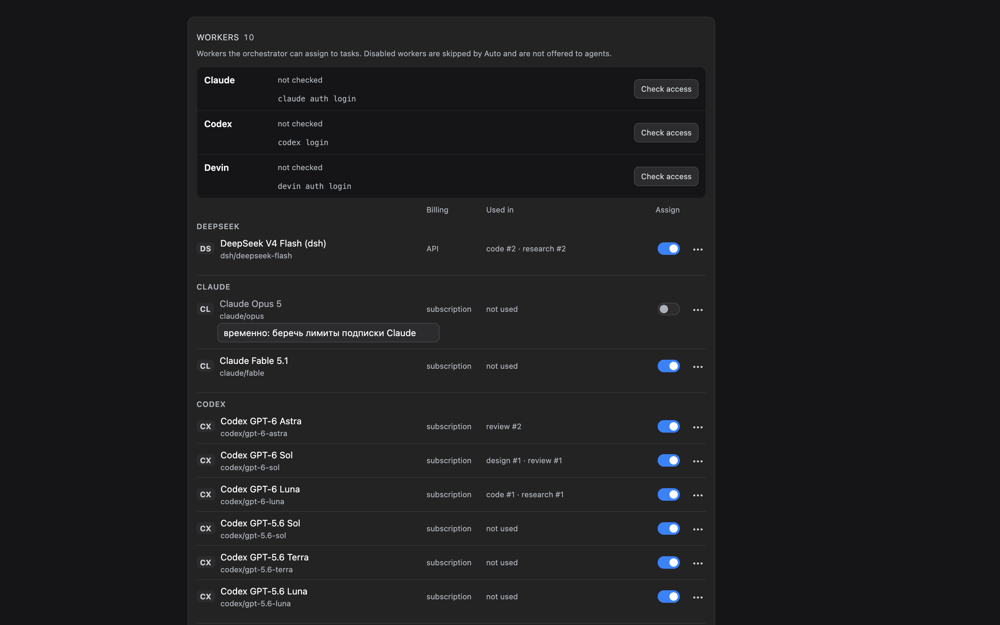

# Воркеры

[Документация](../README.md) · [English](../en/workers.md) | **Русский**

Воркер — это CLI кодового агента, который Crewboard запускает для задачи: Claude Code, Codex, Devin или агент dsh (например, DeepSeek). Воркеры разных провайдеров могут брать задачи одного плана.



*Настройки Crewboard в dsh: зарегистрированные воркеры, проверка доступа и порядок для каждого класса задач.*

## Какие CLI поддерживаются

| Вид | CLI | Что проверяется перед запуском |
| --- | --- | --- |
| `claude` | Claude Code, `claude` | `claude --version`; `claude auth status` должен показывать выполненный вход. Для модели с известной минимальной версией сравнивается версия Claude Code (см. [ниже](#минимальная-версия-cli)). |
| `codex` | Codex CLI, `codex` | `codex --version`; квота подписки должна быть израсходована меньше чем на 90 %, если её удаётся прочитать через `codex app-server`. |
| `devin` | Devin CLI, `devin` | `devin --version` должен показывать выпуск `3000.x`; `devin auth status` — выполненный вход. |
| `dsh` | dsh, `dsh` | `dsh --version`; `dsh --profile acp --dump-config` должен выполняться без ошибок. |

Каждому воркеру нужен свой установленный CLI с выполненным входом; учётными записями и ключами Crewboard не занимается. Проверить воркера:

```sh
crewboard preflight -a claude/opus
crewboard preflight            # все включённые профили
```

Успешная проверка кэшируется на пять минут в `.orchestration/preflight-cache.json`; неудачная повторяется при следующем запуске.

## Реестр

`crewboard workers` показывает реестр и порядок по классам. При первом использовании реестр `~/.config/crewboard/workers.json` создаётся с такими записями:

| Воркер | Модель | Оплата |
| --- | --- | --- |
| `dsh/deepseek-flash` | DeepSeek V4 Flash через dsh | API |
| `claude/opus`, `claude/fable` | Claude Opus 5, Claude Fable 5.1 | подписка |
| `codex/gpt-6-astra`, `codex/gpt-6-sol`, `codex/gpt-6-luna` | модели Codex GPT-6 | подписка |
| `codex/gpt-5.6-sol`, `codex/gpt-5.6-terra`, `codex/gpt-5.6-luna` | модели Codex GPT-5.6 | подписка |

Работают и короткие псевдонимы, например `codex` для `codex/gpt-6-astra` и `claude-opus` для `claude/opus`. Идентификатор вида `claude/<модель>` или `codex/<модель>` можно использовать без регистрации, например `-a claude/opus-5-5`. Devin вызывается как `devin`; модель задаёт профиль Devin.

Добавить, изменить или удалить воркера:

```sh
crewboard workers add claude/sonnet --kind claude --model sonnet --label "Claude Sonnet"
crewboard workers disable claude/sonnet --reason "на этой машине нет доступа"
crewboard workers enable claude/sonnet
crewboard workers rm claude/sonnet
```

**Отключённый** воркер остаётся в реестре, но на этой машине не запускается никогда — ни при автоматическом выборе, ни как воркер задачи, ни через `-a`.

Профили воркеров (модель, транспорт, отображаемое имя, признак включения), псевдонимы и общий порядок машины хранятся в `~/.config/crewboard/profiles.json`. Если файла нет, первый запуск копирует `~/.config/dsh-orchestra/` или импортирует старую конфигурацию porch (`~/.config/porch/config.json` или файл из `PORCH_CONFIG`), не меняя источник.

## Классы и порядок

У каждой задачи есть класс: `code`, `design`, `review` или `research`. Он задаётся флагом `--class`; без него вид `review` или `research` даёт одноимённый класс, всё остальное — `code`.

У каждого класса — упорядоченный список воркеров. Общий порядок машины — это встроенный пресет **«Все воркеры»**:

```sh
crewboard workers route review codex/gpt-6-sol,claude/opus
```

Пустой список значит, что задачи этого класса автоматически не запускаются.

## Пресеты

Пресет — именованный порядок для всех четырёх классов. С его помощью можно сказать, например, «в этом репозитории — только воркеры по подписке»:

```sh
crewboard presets add subs --label "Подписки" \
  --code claude/opus,codex --design codex/gpt-6-sol --review codex --research claude/fable
crewboard repo preset subs       # для этого репозитория
crewboard plan preset subs       # только для текущего плана
crewboard plan preset --clear    # план снова следует репозиторию
crewboard presets list           # действующий пресет и откуда он взят
```

Действующий пресет выбирается так:

1. пресет плана;
2. пресет репозитория (`.orchestration/preset.json`);
3. **«Все воркеры»** — общий порядок машины.

Отключённые воркеры и неизвестные идентификаторы убираются из любого действующего пресета. После удаления пресета все репозитории и планы, где он был выбран, возвращаются к **«Все воркеры»**.

## Как выбирается воркер

Пресет — решение владельца. Кто может выбрать воркера, зависит от того, кто спрашивает:

- **Человек** — на экране dsh или в интерактивном терминале — может назначить любого воркера, даже вне пресета. У такой задачи появляется метка «выбрано вручную».
- **Агент** — оркестрирующий агент, который вызывает CLI без терминала, или агент в чате через инструменты Crewboard — может назвать только воркера, которого действующий пресет разрешает для класса задачи. Иначе отказ (код выхода 2) со списком разрешённых воркеров. Обычно агенту вообще не стоит называть воркера: пусть решает пресет. Если действительно нужен другой, агент спрашивает человека.

При запуске задачи (`crewboard run <задача>` или «Запустить» на экране):

1. **`-a <воркер>`**, если указан, переназначает задачу (по правилу выше).
2. **Назначенный воркер задачи**, если он есть. Назначение человека работает и вне пресета. Назначение агента работает, только пока текущий пресет его разрешает; после смены пресета решает пресет, а в ленте задачи появляется запись об этом.
3. **Пресет**: список действующего пресета для класса задачи, по порядку. Запускается первый воркер, у которого есть профиль и который прошёл проверку. Выбор пресета не записывается как воркер задачи.

Названный воркер проверяется так же, как автоматический — отключён ли он, есть ли профиль, прошёл ли проверку, — и при неудаче запуск **отклоняется** с причиной; молча подставить другого Crewboard не станет. `crewboard task set <id> --worker auto` снимает назначение, и снова решает пресет.

Каждый запуск записывает фактического воркера, модель, провайдера и кто его выбрал (пресет, человек или агент), поэтому журнал показывает, кто выполнял каждую попытку, даже если назначение потом сменилось.

## Минимальная версия CLI

Некоторым моделям нужен свежий CLI. Crewboard знает, что Claude Opus 5.5 (`opus-5-5`) требует Claude Code **2.1.280** или новее. Запись в реестре может задать собственный минимум полем `minCliVersion` в `workers.json`.

Если минимум задан, проверка сравнивает его с `claude --version`. Например, со старым Claude Code:

```text
✗ claude/opus-5-5
   ✓ binary: 2.1.216 (Claude Code)
   ✗ version: Claude Code 2.1.216 старее 2.1.280, требуемой моделью opus-5-5 → обновить CLI (claude update)
```

Минимальная версия проверяется перед каждым запуском и командой `crewboard preflight -a <воркер>`. `crewboard preflight` без `-a` проверяет все включённые профили, но минимальные версии не применяет.

## Воркеры dsh

Воркер dsh запускает агента dsh по ACP: `-a dsh` — модель dsh по умолчанию, `-a dsh/<модель>` — конкретная модель, например `dsh/deepseek-flash`. Нужен рабочий профиль `acp` в dsh. Стоимость берётся из собственных записей учёта dsh — см. [затраты](costs.md). **Проверьте в своём dsh**, что `dsh --profile acp --dump-config` выполняется, прежде чем полагаться на воркеров dsh.
